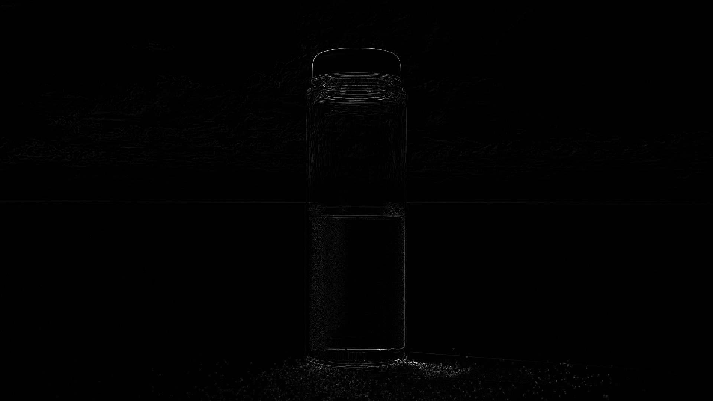

# Imaging (with Qt & CUDA)

## Table of contents
[About this project](#about-this-project)
[Illustrations](#illustrations)
[Requirements](#requirements)
[Build](#build)

## About this project
The goal of this project is to use CUDA with Qt.
There are some imaging functions :
- Absolute difference between two images
- Gaussian blur
- Difference of Gaussian (absolute difference between an image blured N times and the same image blur N + 1 times).
- Pyramide of Difference of Gaussian (Differences of Gaussian of an image, with different N and different scales).
- SIFT descriptors (not working properly yet, it uses all the previous functions).

## Illustrations
-Original image :


-Gaussian blur (multiple passes):


-Difference of Gaussian:


## Requierements
- [Qt](https://www.qt.io/)
- [CUDA](https://developer.nvidia.com/cuda-downloads) or [CUDA 9.0 RC](https://developer.nvidia.com/cuda-release-candidate-download)

## Build
You will need to build CUDA sources before building the Qt project and link the resulting lib to the project :
```
win32:CONFIG(release, debug|release): LIBS += -L$$PWD/../Imaging-functions-CUDA/x64/Release -lImaging-functions-CUDA
else:win32:CONFIG(debug, debug|release): LIBS += -L$$PWD/../Imaging-functions-CUDA/x64/Release -lImaging-functions-CUDA

INCLUDEPATH += $$PWD/../Imaging-functions-CUDA/x64/Release \
            "D:\Program Files\NVIDIA GPU Computing Toolkit\CUDA\v9.0\include"
DEPENDPATH += $$PWD/../Imaging-functions-CUDA/x64/Release
```

To build CUDA sources, I used Visual Studio (2017, with NVIDIA Nsight from CUDA 9.0).